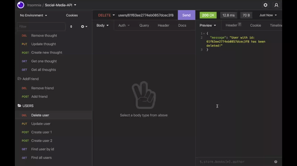

# Social-Network-API
## Description
This is the APIs for a social network web application where users can share, edit and remove their thoughts, react to friends’ thoughts, and create a friend list. Tools such as Express.js for routing, MongoDB database  and Mongoose ODM were used in this application.


## Table of Contents
* [Installation](#Installation)
* [Usage](#Usage)
* [License](#License)
* [Questions](#Questions)
## Installation
Clone the social-netword-api repository to your local computer. Run ```npm install``` in the command line (Win) or terminal (Mac) to install the dependencies.
## Usage
Open Command line (Win) or Terminal (Mac). Go to the social-netword-api folder and run ```node index.js``` or ```npm run dev``` to start the server. Finally open Insomnia or other platfrom of your choice to hit the routes.


 
[Walkthrough Video](https://drive.google.com/file/d/1zb8fdVicytbLWwloDKGRCrbe8PFy49-O/view?usp=sharing)

## License
This Application is covered under MITLicense

For more information about the License visit [MIT License Page](https://choosealicense.com/licenses/mit/)
## Questions
For further questions please contact me at:

GitHub: [https://github.com/hekmatsalehi](https://github.com/hekmatsalehi)

Email: [hekmatullahsalehi@gmail.com](mailto:hekmatullahsalehi@gmail.com)